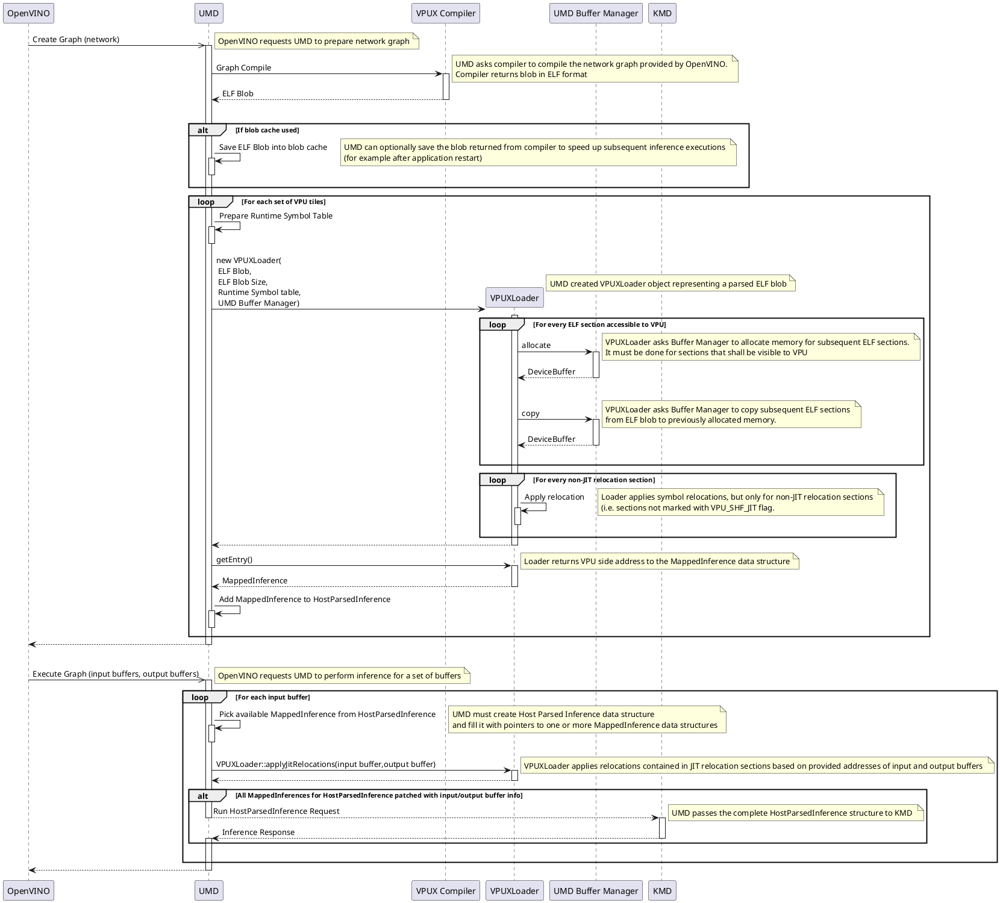

```plantuml("Interaction between UMD and VPUX Compiler ")
@startuml
participant OpenVINO
    participant UMD
    participant Compiler as "VPUX Compiler"
    participant Loader as "VPUXLoader"
    participant BufferMgr as "UMD Buffer Manager"
    participant KMD
    
    autoactivate on
    
    OpenVINO->>UMD: Create Graph (network)
    note right
      OpenVINO requests UMD to prepare network graph
    end note
    
    
    UMD->Compiler: Graph Compile
    note right
      UMD asks compiler to compile the network graph provided by OpenVINO. 
      Compiler returns blob in ELF format
    end note
    return ELF Blob
    |||
    
    alt If blob cache used
        UMD->UMD: Save ELF Blob into blob cache
        note right
          UMD can optionally save the blob returned from compiler to speed up subsequent inference executions 
          (for example after application restart)
        end note
        deactivate
    end
        
    loop For each set of VPU tiles
        UMD->UMD: Prepare Runtime Symbol Table
        deactivate
    
        UMD->Loader**: new VPUXLoader(\n ELF Blob,\n ELF Blob Size,\n Runtime Symbol table,\n UMD Buffer Manager)
        note right 
          UMD created VPUXLoader object representing a parsed ELF blob
        end note
        activate Loader
        loop For every ELF section accessible to VPU
            Loader->BufferMgr: allocate
            note right
              VPUXLoader asks Buffer Manager to allocate memory for subsequent ELF sections. 
              It must be done for sections that shall be visible to VPU              
            end note
            return DeviceBuffer 
            |||
            Loader->BufferMgr: copy
            note right
              VPUXLoader asks Buffer Manager to copy subsequent ELF sections 
              from ELF blob to previously allocated memory.
            end note
            return DeviceBuffer 
            |||
        end
        loop For every non-JIT relocation section
           Loader->Loader: Apply relocation
           note right
              Loader applies symbol relocations, but only for non-JIT relocation sections 
              (i.e. sections not marked with VPU_SHF_JIT flag.
           end note
           deactivate
        end
        Loader-->UMD:
        deactivate Loader
    
        UMD->Loader: getEntry()
        note right
          Loader returns VPU side address to the MappedInference data structure
        end note
        return MappedInference
    
        UMD->UMD: Add MappedInference to HostParsedInference
        deactivate
    end
    
    UMD-->OpenVINO:
    
    
    |||
    
    OpenVINO->>UMD: Execute Graph (input buffers, output buffers)
    note right
      OpenVINO requests UMD to perform inference for a set of buffers
    end note
    
    loop For each input buffer
        UMD->UMD: Pick available MappedInference from HostParsedInference
        
        note right
          UMD must create Host Parsed Inference data structure 
          and fill it with pointers to one or more MappedInference data structures
        end note
        
        deactivate
        
        UMD->Loader: VPUXLoader::applyJitRelocations(input buffer,output buffer)
        note right
          VPUXLoader applies relocations contained in JIT relocation sections based on provided addresses of input and output buffers 
        end note
        
        return 
        
        alt All MappedInferences for HostParsedInference patched with input/output buffer info
            UMD-->KMD: Run HostParsedInference Request
            activate KMD
            note right 
              UMD passes the complete HostParsedInference structure to KMD 
            end note
            KMD-->UMD: Inference Response
            activate UMD
        end
        |||
    end
    
    UMD-->OpenVINO:
@enduml
```
