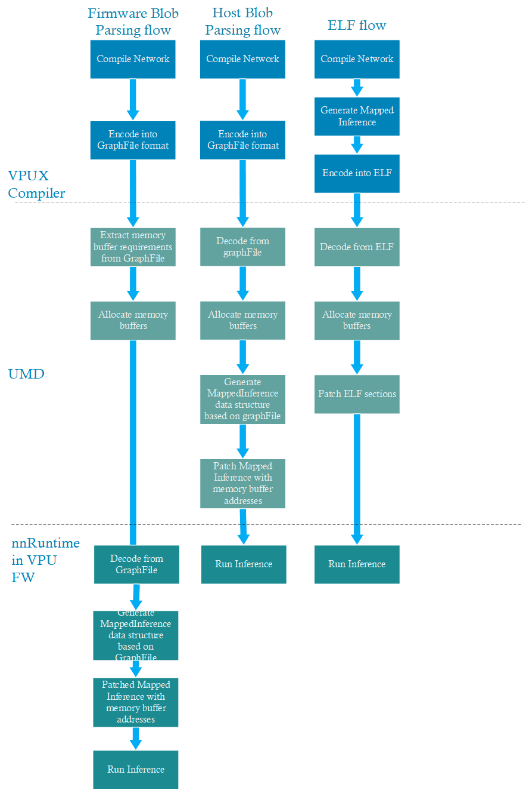
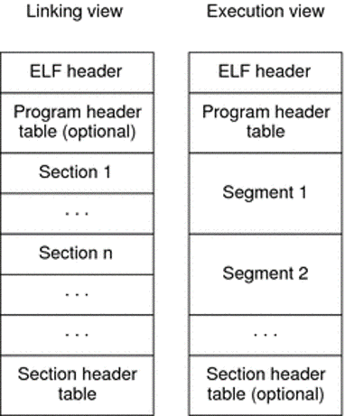
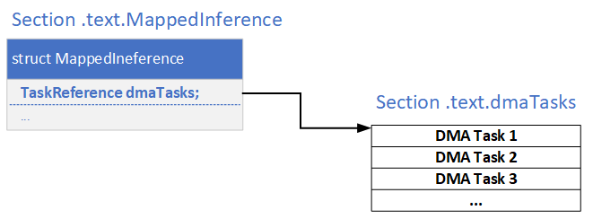
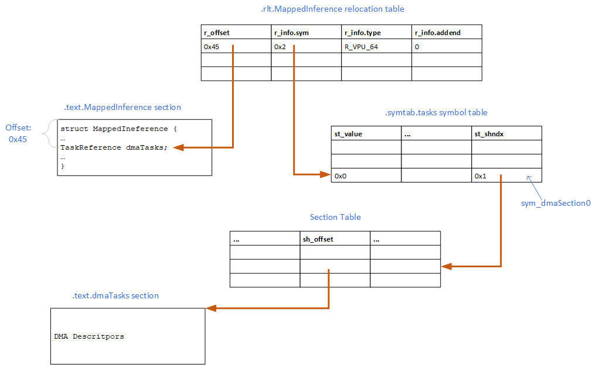
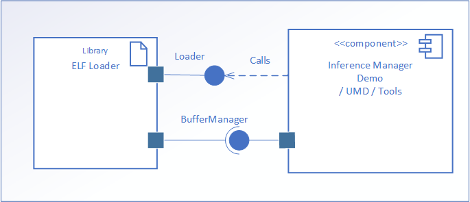
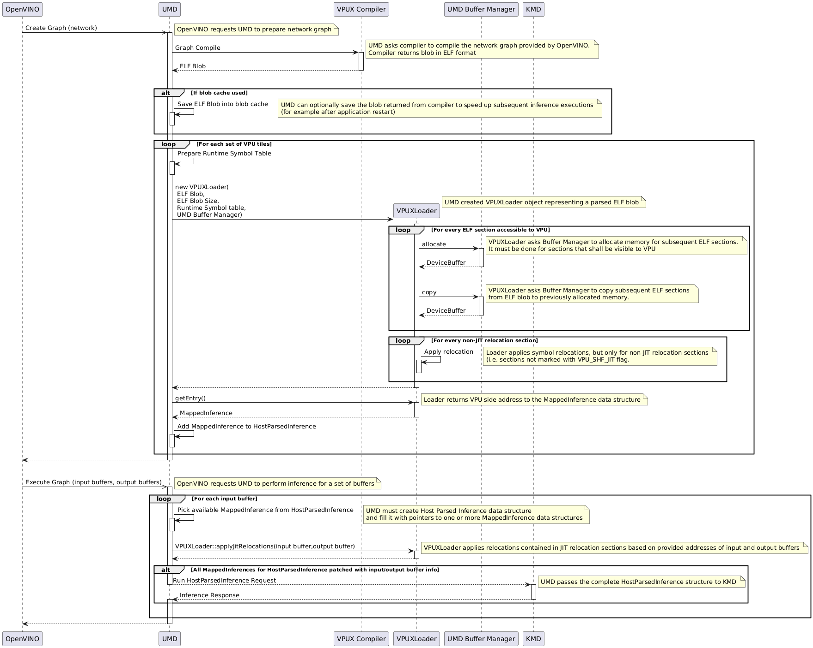

## ELF format usage in VPUX compiler

### Motivations
The following subsections list the reason for using ELF format for blob generated by VPUX compiler

#### First Inference Latency reduction
First Inference Latency is one of the most important KPIs for VPU. It specifies the time between a user space application start and VPU completing the first inference requested by the application. Figure below presents three inference flows that were implemented in various stages of the project.

<!--```visio("..\assets\ELF_format.vsdx", "ELF_vs_Flattbuffers", "GraphFile vs. ELF Inference Flows")

```-->


The first flow implemented in dKMB is Firmware Based Blob Parsing. In this flow VPUX compiler produced a blob in so called GraphFile format, which is using FlatBuffers serialization. Schema for the format is defined in the [repo](https://github.com/openvinotoolkit/npu_plugin_elf). Since VPUX compiler does not know the final memory addresses of different objects/memory buffers used during the inference, the blob does not include such information.
In this solution UMD receives a blob file from VPUX compiler, allocates required memory buffers and passes to VPU FW both the blob and location of various buffers (for example input and output tensors, weights etc.).
Before starting the inference VPU FW must parse the blob. Next it uses information from the blob and location of memory buffers to  create mapped inference data structure, which can be directly used to run the inference process.

Such flow puts significant load on VPU FW and increases inference latency. In particular first inference latency KPI is affected by such approach. In first inference scenario the application stores the blob in some sort of cache (for example in a disk file) and does not invoke compiler to reduce the time between application startup and first inference result being available to the user.

Later dKMB introduced an optimization called Host Blob Parsing (HBP), where the blob produced by compiler was parsed by UMD. In this solution UMD is also responsible for creating the mapped inference data structure that can be easily used by VPU FW. HBP reduces first inference latency by moving some task to UMD, which is running on Host CPU, which has more compute power than LRT in VPU.


ELF format solution goes a step further and eliminates the need to parse blob in graphFile format. The idea is that the VPUX compiler generates a Mapped Inference data structure that can be provided by UMD to VPU FW. The major problem is that VPUX compiler does not know addresses of various memory buffers allocated by UMD. Therefore the inference schedule contained in ELF formatted blob does not include the final addresses, but it used ELF file mechanisms to represent the buffer memory locations in form of symbols. ELF also allows to represent references to the symbols in form of relocation entries. When UMD receives the blob in ELF file format, it can use simple relocation operations to patch the blob with final addresses of the memory buffers. The patching operation is much simpler and faster because it does not require the compiler to understand the mapped inference data structure.

An additional improvement introduced by the ELF format is the ability to load the blob in chunks. Previously when graphFile format was used UMD had to load entire blob from disk into memory in order to parse it. After the parsing if some object inside the blob required special memory allocation UMD had to allocate the memory and copy the object into the memory. In case of ELF format UMD can just load selected sections of the ELF file to understand what memory shall be allocated. Next UMD can allocate the memory buffers and request OS to load the objects/sections from ELF file directly into the allocated buffers. This allows to avoid extra memory copy operations. UMD can also request OS to load the data from file asynchronously and do some other tasks related to inference preparation while OS reads the data from ELF file.

#### Support uArch specific register level task representation
VPUX compiler can generate blobs with inference schedule specific to particular HW generation (for example VPUX3720) without a need to change UMD, because UMD is not aware of the data structures contained in the ELF sections included in the blob. Some of the sections include data structures defining the inference schedule. UMD does not need to understand the data structures. It just looks into relocation instructions and patches the sections based on the relocation sections.

This is possible because ELF format allows for separation of "program code" that NN runtime uses from the information that the system/driver needs to interpret. The "program code" are the data structure describing the inference schedule. The information interpreted by UMD are memory allocation requirements, address patching instructions for buffer allocated by UMD etc...

#### Loading ACT SHAVE kernel images from the blob
In dKMB UPA SHAVE kernels where statically linked with VPU FW. In VPUX3720 due to security reasons the ACT SHAVE kernels must be loaded from Host by UMD. Therefore the kernel images must be included in the blob produced by VPUX compiler. ELF format is better suited for keeping executable code than FlatBuffers format. In particular it natively supports such features as relocation or memory attributes.

#### Cleaner integration path with new Host/UMD managed memory

#### MultiArch versioning support

#### Reducing the network / runtime ABI surface

### ELF Format

#### General description

The following chapter gives high-level ELF format description with emphasis on elements utilized in VPU.Detailed definition of ELF format could be found at this [link](https://refspecs.linuxfoundation.org/elf/elf.pdf). There is also a document that describes general ELF components and ELF extensions required to support specific Sun-specific architectures: [](https://docs.oracle.com/cd/E19683-01/816-1386/6m7qcoblj/index.html), which may serve an inspiration for VPU-specific extensions.

ELF is an extremely flexible format for representing binary code in a system. It can be used to represent various types of binaries like object files, libraries, executable or core dump files.

The following chapters describe the most important parts of ELF format

##### ELF Header
An ELF header resides at the beginning of an object file and holds a road map describing the file's organization.
The below table briefly describes fields in ELF header.

Table: ELF Header fields

| Name  | Description                          |
| :---- | :----------------------------------- |
| e_ident | Identification bytes specify how to interpret the file. They are independent of the processor on which the inquiry is made and independent of the file's remaining contents. For example they specify ABI version, data encoding (little vs. big endian), class (32-bit vs. 64-bit) etc. |
| e_type | Identifies the object file type - for example executable, relocatable, core, shared object     |
| e_machine | Specifies the required architecture for the file. |
| e_version | Identifies the object file version |
| e_entry | The virtual address to which the system first transfers control, thus starting the process. If the file has no associated entry point, this member holds zero. |
| e_phoff |The program header table's file offset in bytes. If the file has no program header table, this member holds zero. |
| e_shoff | The section header table's file offset in bytes. If the file has no section header table, this member holds zero.|
| e_flags |Processor-specific flags associated with the file.|
| e_ehsize | The ELF header's size in bytes.|
| e_phentsize | The size in bytes of one entry in the file's program header table. All entries are the same size.|
| e_phnum | The number of entries in the program header table. The product of e_phentsize and e_phnum gives the table's size in bytes. If a file has no program header table, e_phnum holds the value zero.|
| e_shentsize | A section header's size in bytes. A section header is one entry in the section header table. All entries are the same size.|
| e_shnum | The number of entries in the section header table. The product of e_shentsize and e_shnum gives the section header table's size in bytes. If a file has no section header table, e_shnum holds the value zero.|
|e_shstrndx| The section header table index of the entry that is associated with the section name string table. If the file has no section name string table, this member holds the value SHN_UNDEF.|

##### Sections and Segments

The ELF format specifies two "views" of an ELF file — that which is used for linking and that which is used for execution. This affords significant flexibility for systems designers.



Segments divide ELF file into chunks that are used by loader to load the file into memory. Segment consists of one or more sections. Program Header is used to describe division of file into segments. The header does not need to exist in the ELF file (i.e. is optional). VPUX does not use segments, so VPUX-generated blobs do not include the Program Header and the document does not focus on this construct.

Sections are a way to organize the binary into logical areas to communicate information between the compiler and the linker.
The section header table helps you locate all of the sections of the file. The table consists of multiple entries of the same size. Table below lists all the fields comprising single section header table entry.

Table: Section Header Table Entry structure

| Name  | Description                      |
| :---- | :--------------------------------|
| sh_name | The name of the section. Its value is an index into the section header string table section giving the location of a null-terminated string.|
| sh_type | Categorizes the section's contents and semantics. For example specifies whether the section contains a symbol table, relocation entries, string table etc.|
| sh_flags |Sections support 1-bit flags that describe miscellaneous attributes. For example it identifies sections that should be writable during process execution or that contain executable machine instructions.
| sh_addr | If the section is to appear in the memory image of a process, this member gives the address at which the section's first byte should reside. Otherwise, the member contains 0.|
| sh_offset | The byte offset from the beginning of the file to the first byte in the section. |
| sh_size | The section's size in bytes. Unless the section type is SHT_NOBITS, the section occupies sh_size bytes in the file. A section of type SHT_NOBITS can have a nonzero size, but it occupies no space in the file.|
| sh_link | A section header table index link, whose interpretation depends on the section type. |
| sh_info |Extra information, whose interpretation depends on the section type.|
| sh_addralign | Some sections have address alignment constraints. For example, if a section holds a double-word, the system must ensure double-word alignment for the entire section. That is, the value of sh_addr must be congruent to 0, modulo the value of sh_addralign. Currently, only 0 and positive integral powers of two are allowed. Values 0 and 1 mean the section has no alignment constraints.|
| sh_entsize | Some sections hold a table of fixed-size entries, such as a symbol table. For such a section, this member gives the size in bytes of each entry. The member contains 0 if the section does not hold a table of fixed-size entries.|

##### Symbols and Relocations

The ELF specification provides for symbol tables which are simply mappings of strings (symbols) to locations in the file. Symbols are required for linking; for example assigning a value to a variable foo declared as extern int foo; would require the linker to find the address of foo, which would involve looking up "foo" in the symbol table and finding the address.

Closely related to symbols are relocations. A relocation is simply a blank space left to be patched up later. In the previous example, until the address of foo is known it can not be used. However, on a 32-bit system, we know the address of foo must be a 4-byte value, so any time the compiler needs to use that address (to say, assign a value) it can simply leave 4-bytes of blank space and keep a relocation that essentially says to the linker "place the real value of "foo" into the 4 bytes at this address". As mentioned, this requires the symbol "foo" to be resolved.

There are two ELF section types that have special meaning:
* Symbol Table - holds information needed to locate and relocate a program's symbolic definitions and references.
* Relocation sections - contain relocation entries which define how to modify other ELF files section content during relocation procedure

The below table defines Symbol Table entry structure

Table: Symbol Table Entry

| Field Name  | Description                            |
| :---------- | :------------------------------------- |
|st_name|An index into the object file's symbol string table, which holds the character representations of the symbol names. If the value is nonzero, it represents a string table index that gives the symbol name. Otherwise, the symbol table entry has no name.|
|st_value|The value of the associated symbol. Depending on the context, this can be an absolute value, an address, and so forth. In relocatable files, st_value holds a section offset for a defined symbol. st_value is an offset from the beginning of the section that st_shndx identifies.
|st_size|Many symbols have associated sizes. For example, a data object's size is the number of bytes contained in the object. This member holds 0 if the symbol has no size or an unknown size.|
|st_info|The symbol's type and binding attributes. For example it indicates whether the symbol is global or local.|
|st_other|Symbol visiibility (DEFAULT, INTENAL, HIDDEN or PROTECTED)|
|st_shndx|Every symbol table entry is defined in relation to some section. This member holds the relevant section header table index.|


The below table defines Relocation Entry structure used in Relocation sections

Table: Relocation Entry

| Field Name  | Description                     |
| :---- | :------------------------------------ |
| r_offset | This member gives the location at which to apply the relocation action. Different object files have slightly different interpretations for this member. For a relocatable file as generated by VPUX, the value indicates a section offset. The relocation section itself describes how to modify another section in the file. Relocation offsets designate a storage unit within the second section.|
|r_info | This field consists of 2 subfields:  symbol table index, with respect to which the relocation must be made, and the type of relocation to apply. For example, a call instruction's relocation entry will hold the symbol table index of the function being called. Relocation types are processor-specific and define various algorithms to be applied to symbol values to calculate final value to be patched in the place pointed by r_offset field.|
| r_addend | This member specifies a constant addend used to compute the value to be stored into the relocatable field.|

A relocation section can reference two other sections: a symbol table, identified by the sh_info section header entry, and a section to modify, identified by the sh_link section header entry.

##### ABI Extensibility
ELF permits (and in some places imposes) OS and Arch type extensibility. Relocation types are by definition processor arch specific. Section, segment and symbol metadata have field value ranges reserved for OS/Arch specific values.


#### VPU Specific Elements
This chapter describes various ELF format elements that are VPU specific and not covered by general ELF specification such as relocation types or sections.


##### Relocation Types
Relocation Types are values set in r_info field in relocation entry structure. The relocation types are by defintion specific to particular platform architecture for which the ELF file is targeted for. It specifies how the relocation value is calculated by ELF loader. The below table lists all relocation types used in VPU ELF blobs. The formulas included in the table use the following notation:

* A - The addend used to compute the value of the relocatable field.
* S - The value of the symbol whose index resides in the relocation entry.
* Z - The size of CMX locator

Table: VPUX Relocation Types

|Relocation Type|Value|Calculation Formula       | Usage     |
|:--------------|:----|:-------------------------|:----------|
|R_VPU_64|0|Dst = S + A|DMA source and destination fields, MappedInference fields (variants, invariants, dma, barriers)|
|R_VPU_64_OR|1|Dst \|= S + A|link_address relocation in DMA in case of linking to DDR|
|R_VPU_DISP40_RTM|2|1) oldDst = Dst & 0xffffffffff <br> 2) Dst &= 0xffffff0000000000 <br> 3) Dst \|= (S + (A * (oldDst & (Z - 1)))) & 0xffffffffff  |link_address relocation in DMA in case of linking to CMX slot|
|R_VPU_64_LSHIFT|3|Dst <<= S|Barriers relocation|
|R_VPU_32|4|Dst = S + A|Applied for the target address being reinterpreted as uint32_t*|
|R_VPU_32_RTM|5|Dst = (S + (A * (Dst & (Z - 1))))|Invariant_addr field of variant|
|R_VPU_32_SUM|6|Dst += S + A|weight_table_offset field of variant|
|R_VPU_32_MULTICAST_BASE|7|Dst = to_dpu_multicast_base(S + A)|pt_base and sp_base fields of invariant|
|R_VPU_32_MULTICAST_BASE_SUB|8|Dst = to_dpu_multicast_base(S + A) - Dst|base_adr field of invariant|
|R_VPU_DISP28_MULTICAST_OFFSET|9|unsigned int offs[3] = {SLICE_LENGTH >> 4, SLICE_LENGTH >> 4, SLICE_LENGTH >> 4}; <br> to_dpu_multicast(S + A, offs[0], offs[1], offs[2]); <br> oldDst = Dst >> 4<br> Dst &= 0xf <br>  Dst \|= offs[oldDst] << 4 <br> Where SLICE_LENGTH = 2 * 1024 * 1024|cast_offset field of invariant|
|R_VPU_DISP4_MULTICAST_OFFSET_CMP|10|unsigned int offs[3] = {SLICE_LENGTH >> 4, SLICE_LENGTH >> 4, SLICE_LENGTH >> 4}; <br> to_dpu_multicast(S + A, offs[0], offs[1], offs[2]); <br> oldDst = Dst & 0xf <br> Dst &= 0xfffffff0 <br> Dst \|= offs[oldDst] & 0xf <br> Where SLICE_LENGTH = 2 * 1024 * 1024| cast_enable field of invariant|

##### Symbol Types
VPU ELF format uses custom symbol type VPU_STT_ENTRY equal to 10. It is used to mark a symbol that is an entry into Mapped Inference. Note that this is temporary solution due to ease of implementation. The final solution will use "entry" field in the ELF header.

##### Section Attribute Flags
The below table presents VPU-specific flags used in Section entries.

Table: VPUX Section Attribute Flags

|Flag|Value|Description                    |
|:---|:----|:------------------------------|
|VPU_SHF_JIT| 0x10000000 |The flag indicates relocation sections that must evaluated and patched at each new inference run. It is required to mark sections with relocations relative to user input and output tensors, whose address may change at every inference run.|
|VPU_SHF_USERINPUT| 0x20000000 | TBD|
|VPU_SHF_USEROUTPUT |0x40000000 | TBD|

##### Sections

VPUX compiler uses the below types of sections in ELF-formatted blobs:

* Metadata Section
* Logical Sections
* Regular Sections
* Symbol Table Sections
* Relocation Sections

The following tables list sections in each category

There is only one Metadata section called ".metadata". It uses VPU-specific section type SHT_VPU_NETDESC.

**OPEN: Why we need special type for .metadata section**

Logical section is a section with no actual binary content in the ELF file. There is only one logical section called ".bss.actKernelRtConfigSec". The section defines memory area required for the SHAVE management kernel configuration.


Table: Regular Sections

| Name  | Descritpion |
| :---- | :------------------------------ |
| .data.BuffersIO | Input/Output buffers located in DDR. They do not include user input/output tensor buffer (i.e. input/outputs to/from the entire inference), since their allocation is not managed by VPUX compiler.|
| .text.dmaTasks | Contains NN DMA Tasks |
| .text.BarrierConfigs |Contains barrier configuration |
| .text.KernelText | Contains .text sections of all ACT SHAVE kernels used in the network |
| .text.KernelData | Contains .data and .arg.data sections of all ACT SHAVE kernels used in the network|
| .text.KernelParams | Contains parameters of all ACT SHAVE kernels used in the network. It also contains information about shapes of input and output tensors of all ACT SHAVE kernels|
| .text.ActKernelRanges | Contains Kernel Range data structures for all ACT SHAVE kernels used in the network. Each Kernel Range includes kernel type, kernelEntry point, code and data size etc.|
| .text.ActKernelInvocations |Contains Kernel Invocation data structures for all ACT SHAVE kernels used in the network. |
| .text.MappedInference | Contains Mapped Inference data structure|


Table:  Symbol Table Sections

| Name  | Description |
| :---- | :----------------------------------------- |
| .symtab.buffers | Symbols for ".data.BuffersIO" section |
| VPU_RT_SYMTAB |These are special symbols not related to any section. It contains multiple symbols that corresponds to a set of VPU FW configuration variable that driver shall query from VPU FW at startup. The symbol values are later used by the driver to patch some sections using relocation process.|
| .symtab.input     | Symbols related to input tensors |
| .symtab.output    | Symbols related to output tensors |
| .symtab.actKernelRtConfig| Symbols related to ACT SHAVE Runtime Kernel Configuration |
| .symtab.tasks | Symbols for the below sections: <br> .text.dmaTasks <br> .text.BarrierConfigs <br> .text.KernelText <br> .text.KernelData <br> .text.KernelParams <br> .text.ActKernelRanges <br> .text.ActKernelInvocations |


Table:  Relocation Sections

| Name  | Descritpion |
| :---- | :--------------------------------------- |
| .rlt.KernelParams       | Patching text.KernelParams section based on symbols defined in .symtab.tasks   |
| .rlt.KernelParamsIO_DDR | Patching text.KernelParams section based on symbols defined in .symtab.buffers |
| .rlt.ActKernelRange     | Patching text.ActKernelRanges section based on to symbols defined in .symtab.tasks    |
| .rlt.ActKernelInvo      | Patching text.ActKernelInvo section based on symbols defined in .symtab.tasks|
| .rlt.MI_AKRtConfig      | Patching text.MappedInference section based on symbols defined in .symtab.actKernelRtConfig  |
| .rlt.DMA_NetInput       | Patching text.dmaTasks section based on symbols defined in .symtab.Input |
| .rlt.DMA_NetOutput      | Patching text.dmaTasks section based on symbols defined in .symtab.Output |
| .rlt.dmaIO_DDR          | Patching text.dmaTasks section based on symbols defined in .symtab.buffers |
| .rlt.dmaIO_CMX          | Patching text.KernelParams section based on symbols defined in VPU_RT_SYMTAB |
| .rlt.MappedInference    | Patching text.MappedInference section based on symbols defined in .symtab.tasks |

#### Patching using ELF relocation mechanism - example

This chapter show patching procedure using .text.MappedIneference and .text.dmaTasks sections as examples.

.text.MappedInference section includes MappedInference data structure. The data structure includes dmaTasks field, which is a pointer to a table of DMA task descritpors. The table is located in .text.dmaTasks section.

<!-- ```visio("..\assets\ELF_format.vsdx", "Relocation Overview", "Inter-section address dependency")

```-->



When compiler generates the ELF file it cannot set the the dmaTask field in MappedInference structure, because it does not know the address at which the .text.dmaTasks section will be loaded by the driver. The address is known to the driver after it allocates memory for .text.dmaTasks section.
So the compiler must use relocation and symbol sections to instruct driver how to update the dmaTasks field after memory for .text.dmaTasks section is allocated.
The compiler creates "sym_dmaSection0" symbol and puts it into the table located in ".symtab.tasks" symbol table section. The st_shndx field in the symbol table entry points to the section table entry for ".text.dmaTasks". The st_value in the symbol table entry is equal to 0, because the table of DMA tasks starts at the beginning of ".text.dmaTasks" section.

In the next step the compiler creates an entry in ".rlt.MappedInference" relocation table. The r_offset field in the relocation entry is set to the offset of dmaTasks field of MappedIneference structure. The sym part of r_info field of the relocation entry is set to the index of "sym_dmaSection0" symbol in the ".symtab.tasks" symbol table. The type part of r_info field is set to R_VPU_64, which tells the driver that the final value of the dmaTasks field shall be calculated by adding the value of "sym_dmaSection0" symbol (i.e. the address of memory at which the ".text.dmaTasks" section starts) with the r_addend field of the relocation entry. In this case, the compiler sets the addend to 0.

The below picture shows the links between various tables involves in the defining relocation.

<!-- ```visio("..\assets\ELF_format.vsdx", "Relocation Example", "Relocation Example")
``` -->



### ELF Loader

ELF Loader is a library that is responsible for parsing ELF files and applying relocations (a.k.a. address patching). It will be used by Inference Manager Demo, UMD and tools used by VPUX compiler team for internal purposes.
It means that the library will be used in different programming environments (Firmware, driver and user space apps), which differ in the area of memory management. Therefore the library abstracts away this functionality in a form of BufferManager object that must be implemented by the entity calling the library.

<!-- ```visio("..\assets\ELF_format.vsdx", "Loader", "ELF Loader Library")
``` -->



#### Loader Interface

The table describes API exposed by the Loader library

Table:  Symbol Table Sections

| Function Name  | Description |
| :---- | :------------------------------------------------- |
| ```VPUXLoader(void* elf, size_t elfSize, details::ArrayRef<SymbolEntry> runtimeSymTabs, BufferManager* bufferManager)``` | Constructor creating the loader object. It parses the ELF files, uses BufferManager to allocate memory for all sections that includes data used by VPU and performs section relocation procedure for sections/objects, whose memory address is does not change with each inference execution.|
| ```uint64_t VPUXLoader::getEntry()```| Returns VPU-side address of MappedInference data structure|
|```void VPUXLoader::applyJitRelocations(std::vector<DeviceBuffer>& inputs, std::vector<DeviceBuffer>& outputs)```| Applies relocation for input and output tensor buffers|
|```details::ArrayRef<DeviceBuffer> VPUXLoader::getAllocatedBuffers()```|Returns buffers allocated by the loader using BufferManager object|
|```details::ArrayRef<DeviceBuffer> VPUXLoader::getInputBuffers();```|Returns input buffers |
|```details::ArrayRef<DeviceBuffer> VPUXLoader::getOutputBuffers();```|Returns output buffers |
|```class DeviceBuffer``` | Represents a buffer allocated by Buffer Manager|
|```uint8_t* DeviceBuffer::cpu_addr()```| Returns the Host-side address to the beginning of the buffer. It is used by loader to modify data contained in the buffer|
|```uint8_t* DeviceBuffer::vpu_addr()```| Returns the VPU-side address to the beginning of the buffer. Loader uses the address to calculate symbol values utilized during relocation|
|```size_t DeviceBuffer::size()```| Returns size of the allocated buffer|

#### BufferManager Interface

The table below presents BufferManager API that must be implemented by a component that uses VPU ELF Loader library

Table: Buffer Manager Functions

| Function Name  | Description |
| :---- | :---------------------------------------------- |
|``` DeviceBuffer allocate(size_t alignment, size_t size)```| Requests allocation of a buffer for an ELF section |
|``` void deallocate(DeviceBuffer& devAddress) ``` | Requests deallocation of a previously allocated buffer |
|``` size_t copy(DeviceBuffer& to, const uint8_t* from, size_t count)```| Copies data from an ELF section into a previously allocated buffer|


### Flows
This chapter describes usage flows for ELF format

#### UMD Interaction

The picture table shows how UMD interacts with VPUX Compiler and ELF Loader library



#### Inference Manager Demo

Another application using ELF Loader library is Inference Manager Demo application running on VPU. Its interaction with ELF loader library is very similar to how UMD is using the loader. It just does not call compiler, because in this scenario the blob is compiled offline on the Host and passed to IMD using moviDebug tool.
